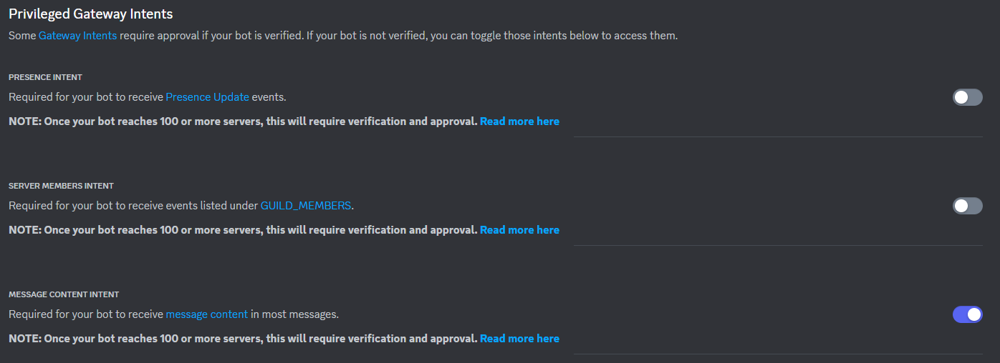
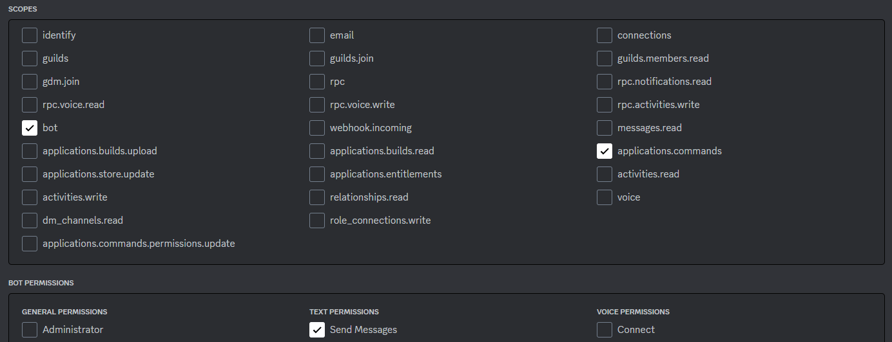

<!--  -->
# Setting up your discord bot

## Creating an app
First, you'll need to create an app in the developer portal if you don't have one already:

[!button Create App](https://discord.com/developers/applications?new_application=true)

Enter a name for your app, then press **Create.**

After you create your app, you'll land on the **General Overview page** of the app's settings where you can update basic information about your app like its description and icon. You'll also see an **Application ID** and **Interactions Endpoint URL**, which we'll use a bit later in the guide.

### Configuring your bot
--

Next we'll configure the bot user for your app, which allows it to appear and behave similarly to other server members.

On the left hand sidebar click Bot. 

On this page, you can configure settings like its privileged intents or whether it can be installed by other users.
--
--

==- What are intents?
Intents determine which events Discord will send your app when you're creating a Gateway API connection. For example, if you want your app to do something when users add a reaction to a message, you can pass the `GUILD_MESSAGE_REACTIONS` (`1 << 10`) intent.

Some intents are privileged, meaning they allow your app to access data that may be considered sensitive (like the contents of messages). Privileged intents appear and can be toggled on the Bot page in your app's settings. Standard, non-privileged intents don't require any additional permissions or configurations.

More information about intents and a full list of available intents, along with their associated events, is in the [Gateway documentation](https://discord.com/developers/docs/topics/gateway##gateway-intents).
===

There's also a **Token** section on the **Bot** page, which allows you to copy and reset your bot's token.

Bot tokens are used to authorize API requests and carry your bot user's permissions, making them [!badge variant="warning" text="highly sensitive"]. Make sure to never share your token or check it into any kind of version control.

Go ahead and copy the token, and store the token somewhere safe (like in a password manager).
!!!warning
You won't be able to view your token again unless you regenerate it, so make sure to keep it somewhere safe.
!!!

### Adding scopes and bot permissions
Apps need approval from installing users to perform actions in Discord (like creating a slash command or fetching a list of server members). Let's select a few scopes and permissions to request before installing the app.

==- What are scopes and permissions?
When creating an app, scopes and permissions determine what your app can do and access in Discord servers.

- OAuth2 Scopes determine what data access and actions your app can take, granted on behalf of an installing or authenticating user.
- Permissions are the granular permissions for your bot user, the same as other users in Discord have. They can be approved by the installing user or later updated within server settings or with permission overwrites.
===

-
Click on OAuth2 in the left sidebar, then select URL generator.

!!!info 
The URL generator creates an installation link based on the scopes and permissions you select for your app. You can use the link to install the app onto your own server, or share it with others so they can install it.
!!!
 
 
 
For now, add two scopes:

- `applications.commands` which allows your app to create commands.
- `bot` adds your bot user. After you select `bot`, you can also select different permissions for your bot. For now, just check Send Messages.
See a list of all OAuth2 scopes, or read more on permissions in the documentation.

### Installing your app
Once you add scopes, you should see a URL that you can copy to install your app.

After installing your app, you can head over to your server and see that it has joined ✨

With your app configured and installed, you can start developing it.