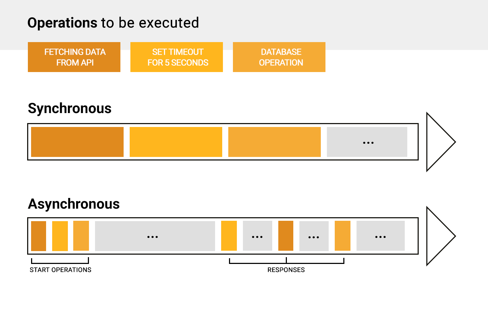
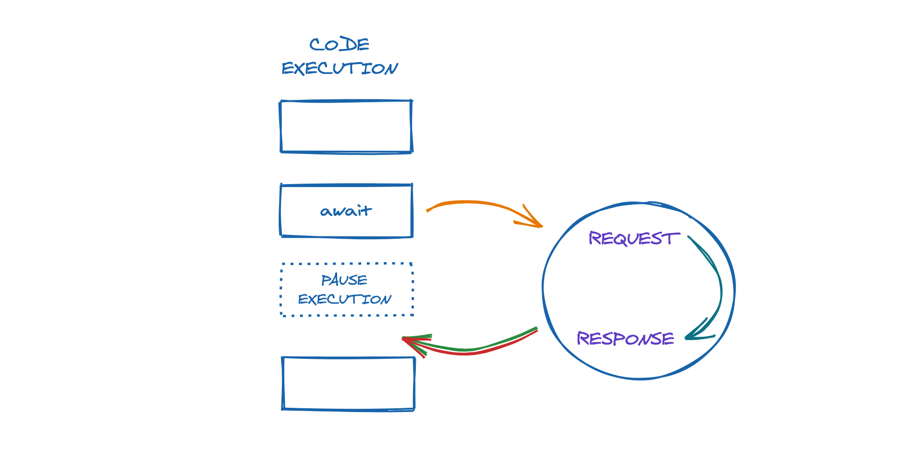

What are those `async def` and `await` keywords actually doing?
First You need to know what the difference between synchronous and asynchronous programming.

Synchronous tasks happen in order, which means that you must finish task one before moving on to the next. Asynchronous tasks can be executed in any order or even simultaneously.

Asynchronous programming, is non-blocking, so the execution of one task isn’t dependent on another. Tasks can run simultaneously and  operations can run in parallel. 

In synchronous programming, the program waits for a particular task to complete before moving on to the next task, whereas in asynchronous programming, the program continues executing other tasks without waiting for the completion of the previous task.

Async/await is a way of writing asynchronous code that is easy to read and understand. It allows you to write asynchronous code that looks and behaves like synchronous code, making it easier to reason about and debug. In Python, async/await is used to create and pause coroutines, which are functions that can be paused and resumed at specific points in their execution. It's especially useful in Discord bots, where you often need to perform multiple tasks at once, such as processing messages and sending responses simultaneously.

To use async/await in Python, you need to define an async function using the `async def` syntax. Within the async function, you can use the `await` keyword to pause execution of the function until a coroutine is complete (this means the data you want is ready/computed). When the coroutine is complete, the value it returns is passed back to the calling function.

